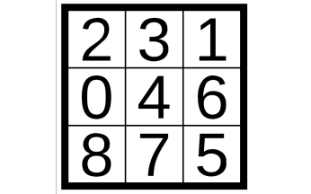

# 8-Puzzle

[](https://svgshare.com/i/Zhy.svg)
[](https://jdk.java.net/)

> ⚠️ Implementação em **java** para o desafio **8-Puzzle**. Todos os detalhes do problema, a abordagem escolhida e os resultados obtidos estão descritos no [**_relatório_**](8_Puzzle.pdf) do projeto.

## Overview

Este projeto aborda a aplicação de diferentes algoritmos de busca (**Breadth-first Search**, **Iterative Deepening Search**, **Uniform-cost Search**, **Greedy Best-first Search**, **A\* Search** e **Hill Climbing**) sobre o jogo conhecido como **8-Puzzle**. Cada um desses métodos teve o desempenho medido, assim como sua complexidade em termos de tempo e espaço. Além disso, duas **heurísticas** foram utilizadas nas buscas com informação, sendo elas: _número de peças fora do lugar_ e a _soma das distâncias de cada peça à sua posição correta_. Os resultados foram comparados e estão apresentados em tabelas, agrupadas pelo tipo de busca. Por fim, uma abordagem mais geral do problema, o **N-Puzzle**, é analisada utilizando o algoritmo **A\***.



## Instalação

Clone o repositório e compile o código utilizando o comando **javac**, de acordo com o exemplo:

```Bash
git clone https://github.com/eduardoatr/8_Puzzle.git
cd 8_Puzzle
javac -d . puzzle/*.java
```

## Execução

Para executar, basta utilizar o comando **java**, fornecendo como parâmetros o **caminho** para o arquivo contendo a entrada no formato adequado, seguido pelo caminho do arquivo de saída, como mostrado no exemplo a seguir:

```Bash
java puzzle.Main "testes/3_puzzle.in" "3_puzzle.out"
```

O arquivo de entrada contém em sua primeira linha um inteiro **N** e uma **string**. O valor **N** indica o tamanho do tabuleiro e a **string** indica o modo de execução do programa, que pode ser:

- **_SIMPLES_**: Indica uma execução simples do programa, que faz o cálculo apenas da quantidade de movimentos e do caminho para cada tabuleiro de entrada;
- **_TESTE_**: Além de calcular o número de movimentos e o caminho, o modo de teste também gera outras estatísticas como o tempo de execução, o número de nodos gerados e explorados.

As próximas linhas do arquivo de entrada devem conter sequências de números que representam as peças do tabuleiro, separados por espaços, onde o primeiro número é a peça da primeira posição do canto superior esquerdo e o último número representa a última peça do canto inferior direito. Além disso, o espaço vazio deve ser representado pelo número **zero**, como mostrado no exemplo a seguir:

```text
3 TESTE
1 0 3 2
1 2 0 3
0 1 3 2
0 2 1 3
3 1 0 2
2 0 1 3
3 1 2 0
2 3 1 0
3 0 2 1
2 3 0 1
0 3 2 1
```

A saída do programa é um arquivo onde a String "**_Entrada(N)_**" inicia um bloco para as soluções da linha **N** do arquivo de entrada. O bloco de soluções dividido em sub-blocos, uma para cada algoritmo, onde em sua primeira linha está indicado o algoritmo executado, seguido do número de movimentos. Na linha seguinte é indicada a sequência de movimentos a serem executados para obter a solução encontrada pelo método, sendo que os valores possíveis são: **_Cima_**, **_Direita_**, **_Esquerda_** e **_Baixo_**.

Além disso, se o programa for executado em modo de teste, eles irá gerar 3 linhas extras contendo o tempo, o número de estados gerados e explorados para cada algoritmo, sendo executa de uma vez todos eles sobre cada um dos tabuleiros fornecidos no arquivo de entrada. O **Greedy Best-First Search** é executado com a heurística do número de peças fora do lugar, já o **A\*** e o **Hill Climbing** são executados utilizando a soma das **_Distâncias de Manhattan_** para cada peça.

O diretório **testes** possui exemplos de entradas, e algumas das configurações de tabuleiros geram um espaço de estados significativo, o que deve levar algum tempo de processamento, mesmo com a implementação otimizada. Para mais informações, consulte o [**_relatório_**](8_Puzzle.pdf).
